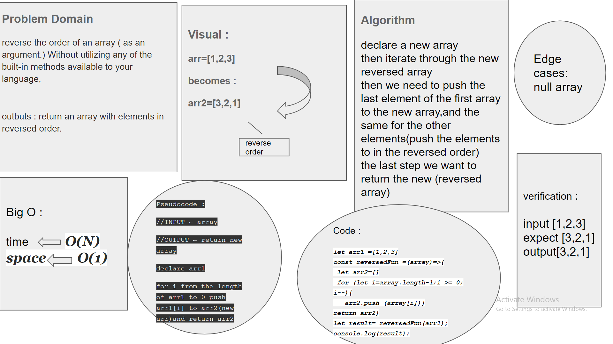

# Reverse an Array
*  a function called reverseArray which takes an array as an argument. Without utilizing any of the built-in methods available to your language, return an array with elements in reversed order.

## Whiteboard Process

## Approach & Efficiency

iterates over the elements of an array Without utilizing any of the built-in methods available to your language, return an array with elements in reversed order.(the last index becomes the first )
Edge cases: null array & the first index undefined

